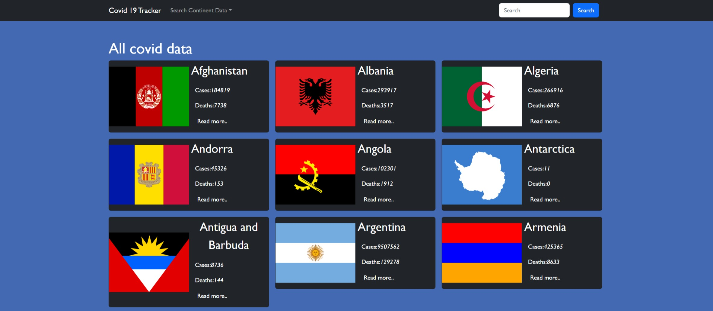

# Covid-19 tracker App

> In this project, we will develop an application to check covid 19 metrics data anywhere on the globe. You can check and historical covid 19 metrics data for any country on the globe. We will build it using react, redux, firebase, react-test-library

## Live link

[https://alfred-covid-19-tracker-102.netlify.app](https://alfred-covid-19-tracker-102.netlify.app)

## Built With

- JavaScript, HTML, CSS
- React.js
- Redux, Redux-toolkit
- Jest

## Getting Started

This project was bootstrapped with [Create React App](https://github.com/facebook/create-react-app).

## Prerequisites

- Node
- Git
- Code Editor

## Insall

Run the following command to get a working version locally

- `git clone https://github.com/learnwithalfred/covid-news.git`
- `cd covid-news`
- `npm install`
- `npm start`

## Test

Run this command to test the application

`npm run test`

## Authors

Alfred Boateng

- GitHub: [@learnwithalfred](https://github.com/learnwithalfred)
- Twitter: [@kb_alfred](https://twitter.com/kb_alfred)
- LinkedIn: [Alfred Boateng](https://www.linkedin.com/in/learnwithalfred/)

## 🤝 Contributing

Contributions, issues, and feature requests are welcome!

Feel free to check the [issues page](../../issues/).

## Show your support

Give a ⭐️ if you like this project!

## Acknowledgments

- API used from [M-Media-Group](https://github.com/M-Media-Group/Covid-19-API)
- Design from [Behanace](https://www.behance.net/sakwadesignstudio)
- Inspiration from [Microverse BootCamp](https://www.microverse.org)
- etc

## 📝 License

This project is [MIT](./MIT.md) licensed.
